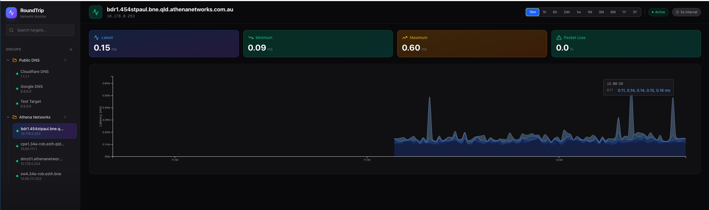
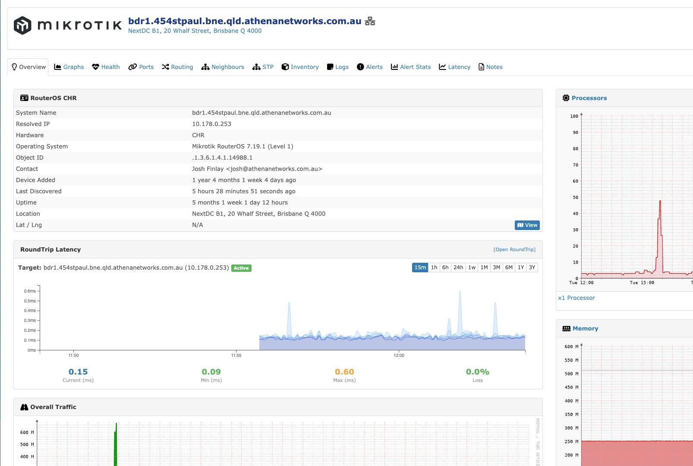

# RoundTrip

Network latency monitoring with smoke-style graphs. Built as a modern alternative to SmokePing.





## What it does

- Pings targets at configurable intervals using fping
- Stores results in TimescaleDB (handles time-series data well)
- Shows individual ping RTTs as layered gradient "smoke" with packet loss markers
- Groups targets for organisation
- Interactive charts with tooltips, configurable time ranges (15m to 3 years)
- Token-based auth, manage users/targets/groups via CLI

Designed to run alongside LibreNMS but works standalone too.

## Requirements

- **Debian** 11 (bullseye), 12 (bookworm), or 13 (trixie)
- **Ubuntu** 20.04 (focal), 22.04 (jammy), or 24.04 (noble)
- PostgreSQL 15 with TimescaleDB (installed automatically)
- PHP 8.1+ (version depends on OS)
- Node.js 20+
- fping 5.5+ (needs JSON output, script builds from source - I could be bias here because I wrote the initial JSON implementation 😛)

## Install

```bash
# As root - installs postgres, timescaledb, php, node, builds fping
./scripts/install-deps.sh

# Creates db, runs migrations, builds frontend
./scripts/setup.sh

# Sets up systemd services
./scripts/install-services.sh
```

## Nginx Setup

Add to your existing nginx server block (works with LibreNMS):

```nginx
include /opt/roundtrip/deploy/nginx.conf;
```

```bash
nginx -t && systemctl reload nginx
```

Access at `http://yourserver/roundtrip`

## First Run

Create an admin user:

```bash
cd /opt/roundtrip
php artisan user:manage
```

Then log in and add targets through the UI, or use the CLI:

```bash
php artisan target:manage
php artisan group:manage
```

## Development

```bash
./scripts/dev.sh
```

Opens at http://localhost:3000/roundtrip

## Services

Two systemd units:

- `roundtrip-api` - PHP backend on port 8000
- `roundtrip-poller` - runs fping against enabled targets

```bash
systemctl status roundtrip-api roundtrip-poller
journalctl -u roundtrip-poller -f  # watch polling logs
```

## LibreNMS Integration

RoundTrip includes a plugin for LibreNMS that shows latency graphs directly on device overview pages. Features:

- Same smoke-style graphs as the main UI
- Real-time updates every 5 seconds
- Time range selector (15m to 3 years)
- One-click button to add devices to RoundTrip

```bash
./librenms-plugin/install.sh
php artisan token:manage  # create a token for LibreNMS
```

Then enable and configure the plugin in LibreNMS under https://librenms/plugin/settings

See `librenms-plugin/README.md` for full setup instructions.

### Bulk Import from LibreNMS

If you've got a bunch of devices in LibreNMS already, you can pull them all into RoundTrip in one go:

```bash
# See what would be imported first
php artisan librenms:import --url=https://your-librenms --token=YOUR_API_TOKEN --dry-run

# Actually do it
php artisan librenms:import --url=https://your-librenms --token=YOUR_API_TOKEN
```

This grabs all your devices and their groups from the LibreNMS API. Devices that already exist (matched by hostname or IP) get skipped. Groups are created automatically if they don't exist yet.

You can set a custom ping interval with `--interval=30` (default is 60 seconds).

## API

All endpoints require auth (Bearer token). Generate tokens with `php artisan token:manage`.

```
GET  /api/targets                    - list targets
POST /api/targets                    - create target
GET  /api/targets/{id}/series        - get ping data (supports ?from=&to=)
GET  /api/groups                     - list groups
POST /api/auth/login                 - get token
```

CORS is enabled by default (allows all origins). If you need to restrict origins, edit `config/cors.php`.

## Stack

- Laravel 12 (API + poller command)
- Next.js 16 (static export)
- TimescaleDB (postgres with time-series optimizations)
- D3.js (charts)
- Tailwind CSS v4
- fping 5.5

## License

Uhh, I don't know. I'm not a lawyer. 
